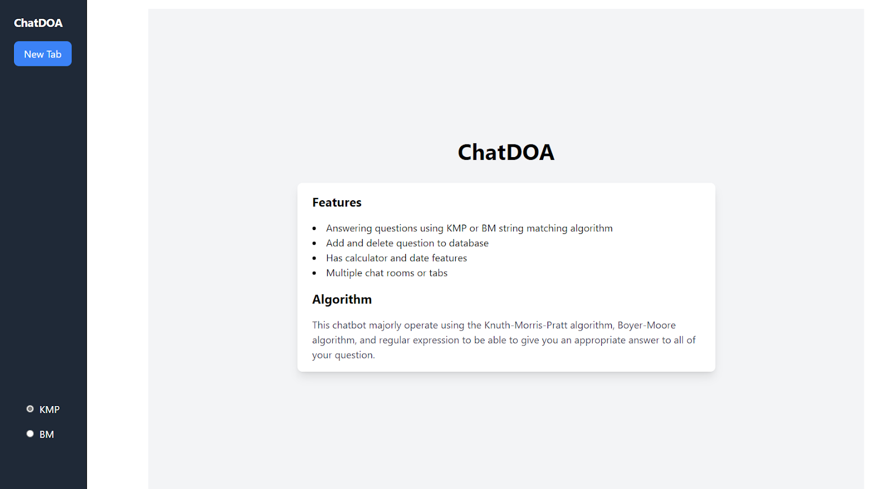

# ChatDOA

> Sebuah aplikasi chatbot yang menggunakan algoritma pencocokan string KMP dan BM <br>
> Link deployment: https://chatdoa.vercel.app

## Table of Contents

- [Deskripsi Program](#deskripsi-program)
- [Teknologi yang Digunakan](#teknologi-yang-digunakan)
- [Fitur Program](#fitur-program)
- [Tampilan Awal Program](#tampilan-awal-program)
- [Cara Menjalankan Program](#cara-menjalankan-program)
- [Anggota Kelompok](#anggota-kelompok)

## Deskripsi Program

ChatDOA adalah Sebuah aplikasi chatbot yang menggunakan algoritma pencocokan string Knuth-Morris-Pratt (KMP) dan Boyer-Moore (BM) dalam pencarian pertanyaan yang paling mirip dengan pertanyaan yang diberikan pengguna. Jika tidak ada satupun pertanyaan pada database yang exact match dengan pertanyaan pengguna melalui algoritma KMP ataupun BM, maka digunakan pertanyaan termirip dengan kesamaan setidaknya 90%. Apabila tidak ada pertanyaan yang kemiripannya di atas 90%, maka chatbot akan memberikan maksimum 3 pilihan pertanyaan yang paling mirip untuk dipilih oleh pengguna. Perhitungan tingkat kemiripan menggunakan algoritma Levenshtein Distance.

## Teknologi yang Digunakan

Aplikasi web yang dibangun menggunakan MERN stack, yaitu:

- MongoDB (database)
- Express.js (backend)
- React (frontend)
- Node.js

## Fitur Program

Berikut adalah fitur-fitur yang tersedia:

- Pertanyaan teks (didapat dari database)
- Kalkulator
- Tanggal
- Tambah pertanyaan dan jawaban ke database
- Hapus pertanyaan dari database
- History chat

## Tampilan Awal Program



## Cara Menjalankan Program

### 1. Clone Repo

Clone repository dengan menuliskan command berikut

```sh
git clone git@github.com:margarethaolivia/Tubes3_13521062.git
```

atau bila menggunakan https

```sh
git clone https://github.com/margarethaolivia/Tubes3_13521062.git
```

Kemudian, masuk ke dalam direktori `src` repository

```sh
cd Tubes3_13521062/src
```

### 2. Install Dependencies

Install semua dependencies yang dibutuhkan dengan menuliskan kedua command berikut

```sh
npm run install-server
npm run install-client
```

### 3. Jalankan Program

#### Server-Side

Untuk menjalankan server, buat file `.env` terlebih dahulu di direktori `backend` yang berisi `MONGODB_URI`, yaitu URI dari MongoDB yang digunakan, serta `PORT`, yaitu port untuk menjalankan server di lokal. Setelah membuat file `.env`, server dapat dijalankan dengan menuliskan command berikut

```sh
npm run start-server
```

Server akan berjalan pada `https://localhost:${PORT}`

#### Client-Side

Untuk menjalankan program pada sisi client dapat dilakukan dengan menuliskan command berikut

```sh
npm run start-client
```

Aplikasi akan berjalan pada `https://localhost:3000`

## Anggota Kelompok

| NIM      | Nama                             |
| -------- | -------------------------------- |
| 13521062 | Go Dillon Audris                 |
| 13521070 | Akmal Mahardika Nurwahyu Pratama |
| 13521071 | Margaretha Olivia Haryono        |
